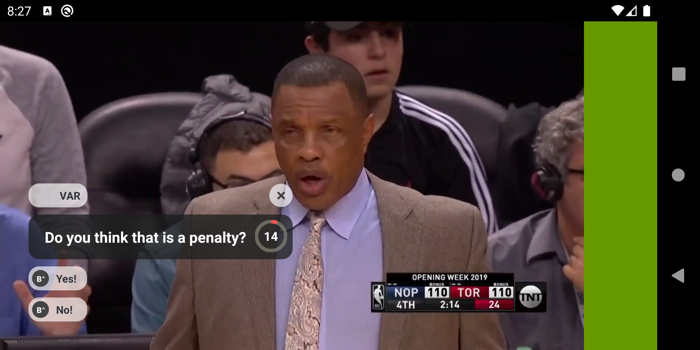

# Buff SDK with sample activity 
[Screenshot-1601522844.png](https://postimg.cc/TLsLP5S2)
 

## Structure
There are 2 major components involved here, a sample application and Buff SDK library.

# Buff SDK
Found in folder "buffsdk", it contains the widget that we have created to fetch buffs and display it
on the clients screen. Inside the `buffsdk/src` you will find two major folders. 
- `main` that contains the base code
- `test` that contains the unit tests

Inside main, the break down of structure looks like this
- `model` the directory contains all the data models
- `network` API service, logging and other network related methods can be found here
- `repositry` It holds the business logic for how buffer are fetched and loaded
- `ui` All views components, their state manager and view holders goes here
- `utils` contain the helpers/utility/constants 

# Working
I am a big fan of reactive programing so that's what has been adopted over here as well. I have used `Flow` for this purpose.
Kotlin Flow is an addition to Kotlin Coroutines. Coroutines save us from callback hell by giving us the possibility to run asynchronous code
as if it was synchronous. Flow takes this a step further by adding streams to the mix. 
Along with `Flow` and `Coroutines` I have adopted for `LiveData`. Unlike a regular observable, LiveData is lifecycle-aware, meaning it respects the
lifecycle of other app components, such as activities, fragments, or services. This awareness ensures LiveData only updates app component observers 
that are in an active lifecycle state.

A combination of all these is what makes out SDK super modular, lifecycle aware and reactive. 

# Sample App
Found in folder `app`, it contains sample application the demonstrates how to integrate SDK with an 
activity. Inside the `app/src` you will find two major folders. 
- `main` that contains the activity the demonstrates integration
- `androidTest` it contains the instrumentation test to verify the widget shows up on the screen.

## Integration:

#### Add BuffView into you layout.xml
Component integrating it is required to implement [LifecycleOwner] to optimize observing on LiveData.
Also, it would avoid any leaks. 
    
    <com.buffup.sdk.ui.BuffLayout
            android:id="@+id/buff_view"
            android:layout_width="match_parent"
            android:layout_height="match_parent"/>

#### Implement `BuffLayout.BuffListener` in order to listen to Buff SDK events
Clients can register to the listener using `buffView.setListener()`

    interface BuffListener {
            fun onBuffLoaded(buff: BuffResult)
            fun onBuffAnswerSelected()
            fun onBuffCleared()
            fun onBuffExpired()
            fun onError(error: BuffError)
    }
    
    
## Libraries

- Kotlin 
- Coroutines
- Flow
- Network (Retrofit)
- Espresso, junit and mockito for testing
- Moshi for JSON parsing

## Improvements
Due to limited time, I missed out on couple of things that i would have liked to add. 

- Add more unit and instrumentation test
- Adding image on the answer, its pretty straight forward actually using Glide. 
- Improve the UI
